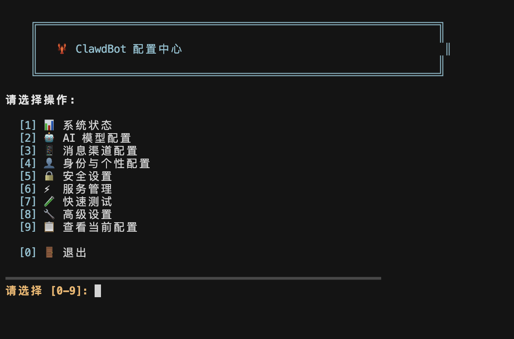
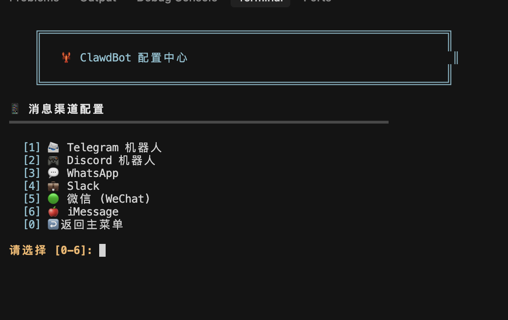

# 🦞 OpenClaw Auto Deploy

<p align="center">
  
  
  
  
</p>

> 一个为 OpenClaw 准备的跨平台一键安装与配置仓库。重点优化 Windows、WSL2、Linux、macOS 的安装体验，尽量把环境检测、依赖修复、配置引导和后续管理全部收拢到一套脚本里。

<p align="center">
  
</p>

## 项目定位

`openclaw-auto-deploy` 不是 OpenClaw 本体，而是围绕 OpenClaw 的安装、初始化、配置和维护体验做的一层“自动部署壳”。

这个仓库的目标很明确：

- 让第一次接触 OpenClaw 的用户也能快速安装成功。
- 尽量降低 Windows 和 WSL2 场景下的踩坑成本。
- 给 Linux 和 macOS 用户提供更顺手的一键化配置流程。
- 把 AI 模型配置、消息渠道配置、服务管理、诊断修复整合到一个交互式菜单里。

## 为什么推荐这个仓库

- 更偏向真实可落地的一键安装，而不是只给出几条命令。
- 安装脚本内置常见问题诊断和自动修复逻辑。
- 重点覆盖 Windows 本地安装与 WSL2 安装这两个最容易出问题的场景。
- 提供独立的 `config-menu.sh`，后续维护不需要反复手动改配置文件。
- README、脚本入口、下载链接、使用说明统一维护，减少文档和命令不一致的问题。

## 平台支持矩阵

| 平台 | 支持情况 | 说明 |
| --- | --- | --- |
| Windows 10/11 | 强支持 | 支持 Git Bash 中触发安装，重点优化 PowerShell 与 WSL2 路径 |
| WSL2 + Ubuntu | 强支持 | 推荐给首次安装用户，兼容性最好 |
| Linux | 强支持 | 已考虑常见依赖安装、端口占用、npm 问题修复 |
| macOS | 强支持 | 支持 Homebrew、Node.js 检测与本地服务管理 |

## 一眼看懂这个仓库

| 你需要什么 | 这里提供什么 |
| --- | --- |
| 第一次安装 OpenClaw | `install.sh` 一键安装向导 |
| 安装后继续配置 | `config-menu.sh` 交互式控制中心 |
| Windows 场景少踩坑 | 针对 Git Bash / PowerShell / WSL2 做额外兼容处理 |
| 遇到奇怪错误 | 内置一部分自动修复与诊断建议 |

## 快速开始

### 方式一：直接一键安装

```bash
curl -fsSL https://raw.githubusercontent.com/MarcusDog/openclaw-auto-deploy/main/install.sh | bash
```

脚本会自动完成这些步骤：

1. 检测系统平台与运行环境
2. 检查并提示安装 Node.js 22+
3. 安装 OpenClaw
4. 引导配置模型、身份和基础参数
5. 自动处理一部分常见安装失败问题
6. 提示你进入配置中心继续完成渠道和服务配置

### 方式二：克隆仓库后本地运行

```bash
git clone https://github.com/MarcusDog/openclaw-auto-deploy.git
cd openclaw-auto-deploy
chmod +x install.sh config-menu.sh
./install.sh
```

## 脚本组成

### `install.sh`

适合第一次安装时使用，主要负责：

- 平台识别
- 依赖检查
- Node.js / npm 环境建议
- OpenClaw 安装
- 自动修复常见报错
- 安装完成后的引导说明

### `config-menu.sh`

适合安装之后长期使用，主要负责：

- AI 模型配置
- Telegram / Discord / Slack / 飞书等消息渠道配置
- 身份与个性配置
- 安全设置
- OpenClaw 服务启停和诊断
- 配置备份、恢复、重置

## 推荐工作流

### 第一次使用

1. 先运行 `install.sh`
2. 按向导完成基础安装
3. 安装完成后进入 `config-menu.sh`
4. 先配模型，再配渠道
5. 最后跑“快速测试”确认消息和模型真的可用

### 日常维护

1. 通过 `config-menu.sh` 调整模型与渠道
2. 遇到问题先看“系统状态”和“服务管理”
3. 有连接异常时先跑 `openclaw doctor`
4. 需要升级时再执行 `npm update -g openclaw@latest`

## 交互式配置中心预览

### 主菜单

<p align="center">
  
</p>

### 模型配置

<p align="center">
  
</p>

### 消息渠道

<p align="center">
  
</p>

### 快速测试

<p align="center">
  
</p>

## 支持的能力

### 1. 多模型接入

支持常见模型提供商与网关，包括但不限于：

- Anthropic Claude
- OpenAI GPT
- DeepSeek
- Kimi / Moonshot
- Google Gemini
- OpenRouter
- Groq
- Mistral AI
- Ollama
- Azure OpenAI
- 自定义 Provider + 自定义模型

### 2. 多渠道接入

支持常见消息或协作渠道：

- Telegram
- Discord
- WhatsApp
- Slack
- 微信
- iMessage
- 飞书

### 3. 自动修复

脚本会尽量处理这些典型问题：

- npm 权限错误
- npm 网络超时
- npm 缓存损坏
- 依赖缺失
- apt / dpkg 锁冲突
- 端口占用
- PowerShell 执行策略导致的脚本拦截
- Windows npm PATH 不完整

## Windows / WSL2 特别说明

这个仓库重点照顾 Windows 用户。

如果你在 Windows 上使用，推荐流程是：

1. 安装 Git Bash
2. 安装 Node.js 22+
3. 运行 `install.sh`
4. 在脚本提示时选择：
   - `Windows 本地安装`，适合希望直接跑在本机上的用户
   - `WSL2 + Ubuntu 安装`，适合追求兼容性和更稳环境的用户

通常情况下，如果你不确定怎么选，直接选 WSL2 更稳。

## 仓库亮点

- 仓库名、下载链接、README 与脚本入口全部统一到 `openclaw-auto-deploy`
- 命令行界面比纯文本提示更清晰，适合第一次安装用户
- 配置中心适合作为后续长期使用的“控制面板”
- 你可以直接把这个仓库作为自己的 OpenClaw 安装分发入口

## 常用命令

### 打开配置中心

```bash
bash ./config-menu.sh
```

### 启动 OpenClaw Gateway

```bash
openclaw gateway start
```

### 查看状态

```bash
openclaw gateway status
```

### 运行诊断

```bash
openclaw doctor
```

### 查看 Dashboard 地址

```bash
openclaw dashboard --no-open
```

## 推荐使用顺序

1. 先执行 `install.sh`
2. 安装完成后执行 `config-menu.sh`
3. 先配置模型
4. 再配置消息渠道
5. 最后进入“快速测试”检查配置是否真实可用

## 常见问题

### 1. 安装过程中提示 Node.js 版本过低

本仓库默认要求 Node.js 22+。请先升级 Node.js 再重新运行脚本。

### 2. Windows 下 `npm.ps1` 被禁用

脚本里已经尝试自动修复 PowerShell 执行策略。如果仍有问题，建议以管理员身份打开 PowerShell 后手动检查执行策略。

### 3. 端口 18789 被占用

安装脚本和配置菜单都内置了端口检测与部分自动释放逻辑。也可以手动检查哪个进程占用了该端口。

### 4. 模型能配置但消息发不出去

优先检查：

- 对应渠道的 Token 是否正确
- 机器人是否已经被拉进群组或服务器
- 渠道 ID / Chat ID 是否填写正确
- OpenClaw Gateway 是否已经正常启动

## 仓库地址

- GitHub: [https://github.com/MarcusDog/openclaw-auto-deploy](https://github.com/MarcusDog/openclaw-auto-deploy)
- 安装脚本: [install.sh](https://raw.githubusercontent.com/MarcusDog/openclaw-auto-deploy/main/install.sh)
- 配置脚本: [config-menu.sh](https://raw.githubusercontent.com/MarcusDog/openclaw-auto-deploy/main/config-menu.sh)

## 与 OpenClaw 的关系

- 本仓库专注于部署、安装和配置体验。
- OpenClaw 的产品功能、核心运行逻辑和官方文档，请以官方项目和官方文档为准。
- 本仓库更像是一个“更适合真实落地使用”的跨平台安装器与控制中心。

## 维护建议

如果你准备把这个仓库长期作为自己的安装入口，建议保持这些内容同步：

- `install.sh` 中的安装命令和仓库地址
- `config-menu.sh` 中的重新安装提示与仓库主页
- README 中的下载命令、克隆地址和截图说明

## License

MIT
